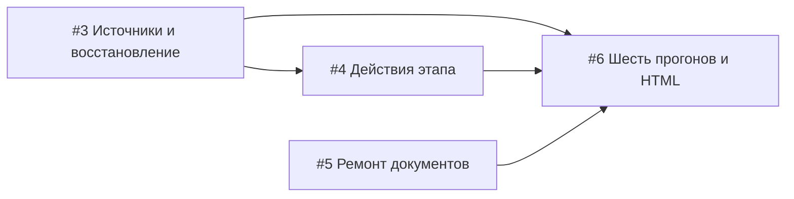

# Реализация спецификации #2

Интеграционная ветка: `integration/guided-model-recovery`.

Исходная точка для сравнения исправлений: `c535e19`. Этот коммит сохраняет существовавшую реализацию guided JSON и локальные настройки; исправления восстановления проверяются относительно него.

## Граф задач



Спецификация: https://github.com/DONXAKer/Agent-SDLC-Runner/issues/2.

## Проверка

Границы интеграционных тестов из спецификации: исполнитель проверки решения с реальными инструментами и политикой; исполнитель заполнения документа с реальным гейтом. Провайдер модели — внешняя граница с детерминированными ответами. Проверки восстановления, запретов и записи выполняются до локальной модельной серии.

Команда повторной серии после завершения проверок:

```powershell
node tools/run-guided-recovery-suite.mjs
```

Runner последовательно выполняет GPT-OSS 20B, Ministral 3 14B, Qwen 3.8 27B IQ4 на add-validator/config-default. Лимиты сохранены: 30 минут на этап, 60 минут на запуск, до трёх попыток реализации, strict-questions. Снимок включает git-ревизию и хэш исходного кода сервера, shared, стенда, конфигурации и package.json. Изменение кода во время серии останавливает её. Прогоны нельзя выполнять одновременно: модели используют общие локальные ресурсы.

Каждый HTML содержит фактический архив HTTP, инструменты, гейт, изменения файла, журнал и итог стенда. Итоговая таблица сравнивает с серией `json-flow-final-20261009065718375`. Валидный JSON не означает разрешённую запись или выполненную задачу. Полный успех требует handoff, положительного вердикта, всех скрытых тестов и проверок честности.

## GitHub CLI в этой среде

Запись через `gh` внутри песочницы возвращала 401; вне песочницы авторизация Windows keyring работает. Не переавторизовывать пользователя только на основании sandbox-ошибки. При необходимой записи использовать штатное разрешение выполнения вне песочницы.
